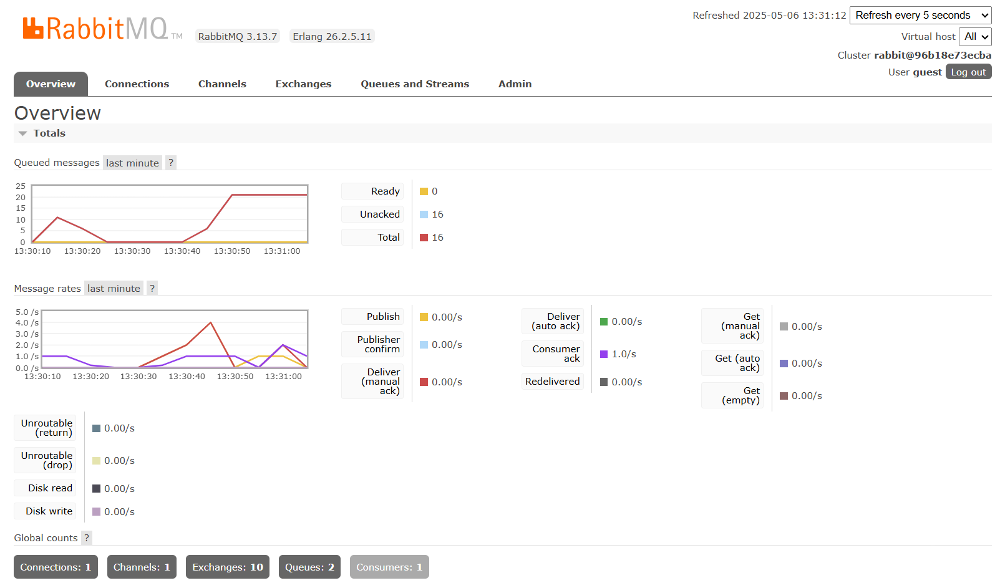
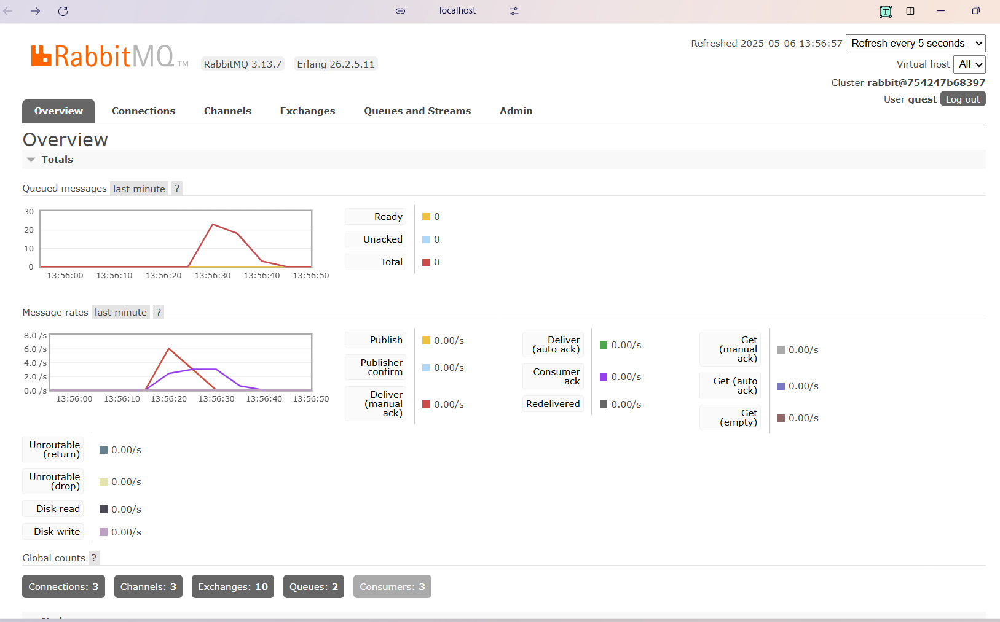
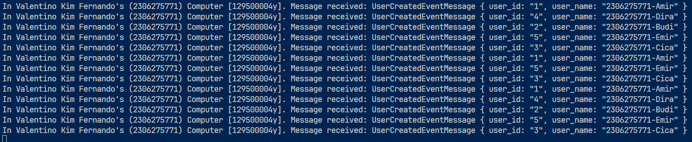
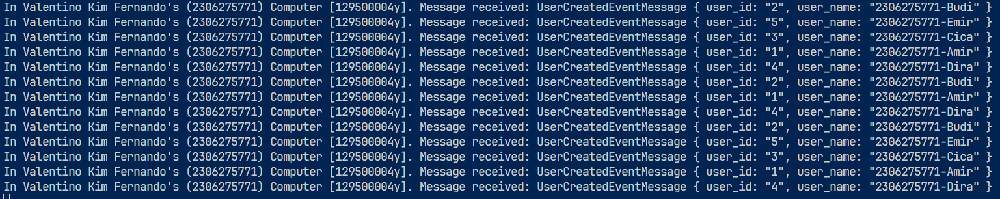
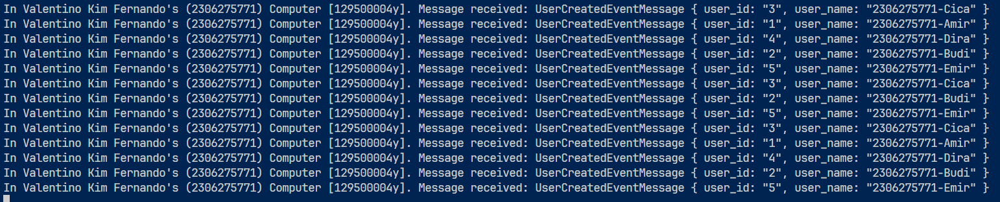

# Question
1. What is AMQP?
AMQP (Advanced Message Queuing Protocol) is an open standard for message-oriented middleware. It enables different applications to communicate and exchange data in a reliable, efficient, and structured way. AMQP is widely used in distributed systems, particularly in scenarios where high reliability and seamless interoperability are critical, such as microservices architectures.

2. What does guest:guest@localhost:5672 mean?
This is a common default connection string for RabbitMQ.
- The first guest represents the username
- The second guest is the password
- localhost:5672 specifies that RabbitMQ is running on the local machine (localhost) and listening on port 5672 (the default AMQP port)awjd

- Why is the message queue growing?
The increasing queue size is caused by the publisher sending messages faster than the subscriber can consume them. While the publisher quickly pushes multiple messages to the broker, the subscriber processes them at a slower pace. As a result, unprocessed messages accumulate in the queue.
On my machine, this led to a total of 21 messages waiting in the queue. This behavior is expected in asynchronous systems where the producer is significantly faster than the consumer, causing a temporary message backlog.

- Why did the message spike decrease with multiple subscribers?
This happened because each subscriber receives a unique portion of the data when the publisher sends a large batch of messages to the queue. Each subscriber acts as an independent application, pulling messages from the queue separately. Once a message is consumed by a subscriber, it is removed from the queue and is no longer available to other subscribers. This distributed processing reduces message congestion and balances the workload more efficiently.

- Console 1

- Console 2

- Console 3
